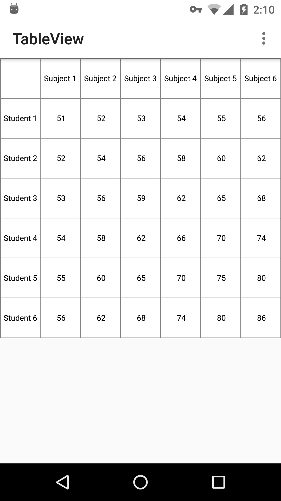
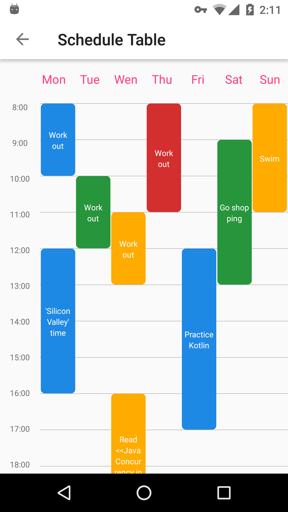
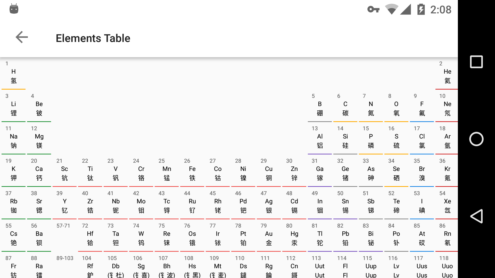

## TableView
This project is made for showing how to write a table view quickly.
Considering the uncertainty demand of table and reducing the dependencies in your project, 
this custom view has no maven or jcenter dependency for you,just copy [TableLayout.java](https://github.com/shineM/TableView/tree/master/app/src/main/java/me/texy/tableview/demo/tableview)
and [attrs.xml](https://github.com/shineM/TableView/blob/master/app/src/main/res/values/attrs.xml) to your project，then rewrite or enjoy it.
You can check out the demo for more detail usage.

### Captures
There are some captures from Demo:

 

### License

    Copyright 2017 shineM.

    Licensed under the Apache License, Version 2.0 (the "License");
    you may not use this file except in compliance with the License.
    You may obtain a copy of the License at

       http://www.apache.org/licenses/LICENSE-2.0

    Unless required by applicable law or agreed to in writing, software
    distributed under the License is distributed on an "AS IS" BASIS,
    WITHOUT WARRANTIES OR CONDITIONS OF ANY KIND, either express or implied.
    See the License for the specific language governing permissions and
    limitations under the License.
